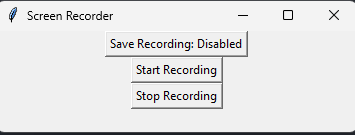

# Activity Tracker: Screen Recording and Deep Learning for User Behavior Detection

**Last Updated:** September 2024

## 1. Objectives
1. Implement a screen recorder using Python's cv2 library to capture the user's screen activity.
2. Develop a deep learning (CNN) model to classify and identify which application or website the user is interacting with (e.g., work-related tools, social media, etc.).
3. Combine the screen recorder with the trained model to analyze and detect user activity in real-time and provide visualized results.
4. Develop an API version of the code for easy integration and usage.

## 2. Requirements
### Python Screen Recorder Requirements
To capture the screen, you'll need the following libraries:
```
pip install opencv-python

pip install pyautogui
```

### CNN Model Training Requirements
To train a Convolutional Neural Network (CNN) model, install these dependencies:
```
pip install tensorflow numpy matplotlib scikit-learn
```

### Interface Requirements
```
pip install tkinter
```

## 3. How to use it 
To get started, simply run /Screen-Recorder-Interface/app.py (ensure you have your pre-trained CNN model ready). The application provides an intuitive interface where you can manage the screen recording. You will have the option to save the recording and access two buttons: one to start and one to stop the recording.



## 4. Usage and Results
This section will demonstrate examples of how the screen recorder and CNN model classify user activities during the screen capture.


## 3. Repositories 
· /Screen-recorder: Contains the Python code to create a screen recorder using the cv2 library.

· /CNNmodel: Code for training the CNN model to classify applications or websites using recorded screen samples.

· /Create_Training: Script to process screen recordings into training data. Takes .mp4 files as input and outputs frame-by-frame folders for CNN training.

· /Screen-recorder-Interface: Final update of Screen recorder. It contains an interface to show it all more aesthetical.

## Participants
Guillem Garcia Dausà (guillemgarcia2183)

Contact e-mail: garcia.guillem.dausa@gmail.com

