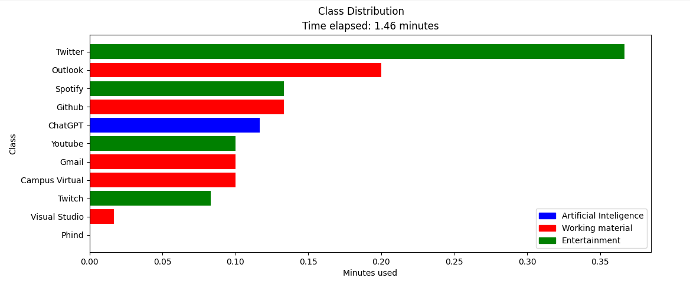
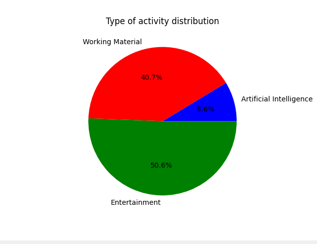

# Screen Recorder to identify an user activity 
## Last update: September 2024

## 1. Objectives
1. Code in python a screen recorder with cv2 library.
2. Code a DL algorithm (CNN) to identify which application/web is using an user.
3. Use the recoder and the trained model to identify what I'm using (Working material, Social media, etc.) - Visualize results.
4. Do an API version of the code.

## 2. Requirements
### Requirements to create the recorder in python 
· pip install opencv-python

· pip install pyautogui

### Requirements to train the CNN model
· pip install tensorflow numpy matplotlib scikit-learn

## 3. Results
Here you'll see some examples of the screen recorder trying to identify what's the activity an user during the footage.

## 3. Repositories 
· /Screen-recorder: Python code to create a screen recorder with cv2 library.

· /CNNmodel: Python code to train a CNN model to identify an application/web, using the screen recorder as training samples.

· /Create_Training: Make the training folders. Input: mp4 archives, Output: Folders frame per frame. 

## Participants
Guillem Garcia Dausà 

Github user: guillemgarcia2183

E-mail: garcia.guillem.dausa@gmail.com

